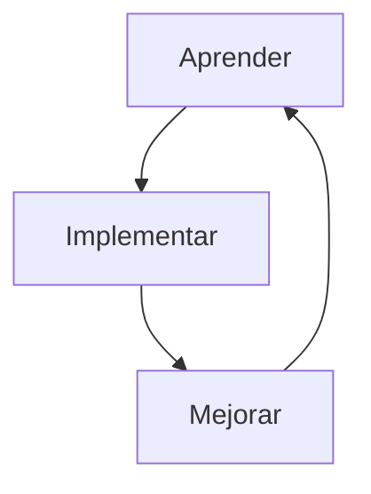

## Hola 👋, y bienvenido a mi perfil!

Soy Hernán Buzzi, tester de aplicaciones y estudiante de desarrollo web Full Stack en la Universidad Nacional de Tres de Febrero! 
He aquí un pequeño resumen sobre mis habilidades y experiencias laborales, te invito a contactarnos y hablar sobre tecnología y oportunidades de construir software juntos 😊

## Bienvenido/a a mi perfil

> Sobre mi
> - 🔭 Probando aplicaciones web y en dispositivos móviles
> - 🌱 Estudiante del curso de desarrollo Full Stack ...
> - 👯 Interesado en colaborar en el diseño de páginas web y procesos de backend utilizando lenguaje JavaScript ...
> - 💬 Puedes preguntarme sobre pruebas de software, te ayudaré con gusto ...
> - 📫 Dejo aquí mi perfil de [LinkedIn](https://www.linkedin.com/in/hernan-b-0aaa38307/) ...

Durante años me dediqué a aprender todo lo necesario para realizar cada tarea asignada, implementando los conocimientos adquiridos para luego buscar formas de mejorar lo que hago, y siempre seguir aprendiendo!

## Formación
 
Aprendí todo lo necesario acerca de pruebas de software, pudiendo crear planes de prueba y diseñar casos de prueba que verifiquen eficientemente los requerimientos de los proyectos de desarrollo de software, colaborando en la mejora contínua de los productos desarrollados por los equipos de trabajo.  

Más sobre mi formación en pruebas de software...

  - Tomé múltiples cursos de calidad de software en plataformas educativas online. 
  - Aprobé el examen de certificación como tester en el International Software Testing Qualification Board (ISTQB) 
  - Realicé y aprobé la capacitación en testing avanzado en la Universidad Tecnológica Nacional (UTN) 

También tomé cursos de programación en lenguajes Python, Java y JavaScript, a fin de desarrollar soluciones que resuelvan el tratamiento y validación de datos usados durante las pruebas de software, así como automatizar la interacción con navegadores web y aplicaciones Android y iOS.  

Mi formación en programación...

  - Realicé la diplomatura en programación en Python brindada por la Universidad Tecnológica Nacional (UTN) 
  - Completé la formación en automatización de pruebas usando lenjuage Java brindada por EducaciónIT 
  - Adquirí conocimientos en programación usando lenguajes JavaScript y Java mediante diversas plataformas, como Udemy y O'Reilly 

## Experiencia Laboral

Durante años pude trabajar en diversas empresas e industrias, mejorando conocimientos y ganando experiencia práctica tanto en grandes procesos como en pequeñas tareas. Las principales empresas en las cuales he trabajado incluyen:

| Empresa | Rol |
| ------- | --- |
| IBM | Test Analyst|
| Globant | Test Lead |
| Verizon Business | QA Team Lead |
| Kapsch TrafficCom | System Acceptance Tester |
| Philip Morris International | IS Analyst |
| BairesDev | QA Engineer |
| AccelOne | QA Automation Engineer |

  
<picture>

</picture>
